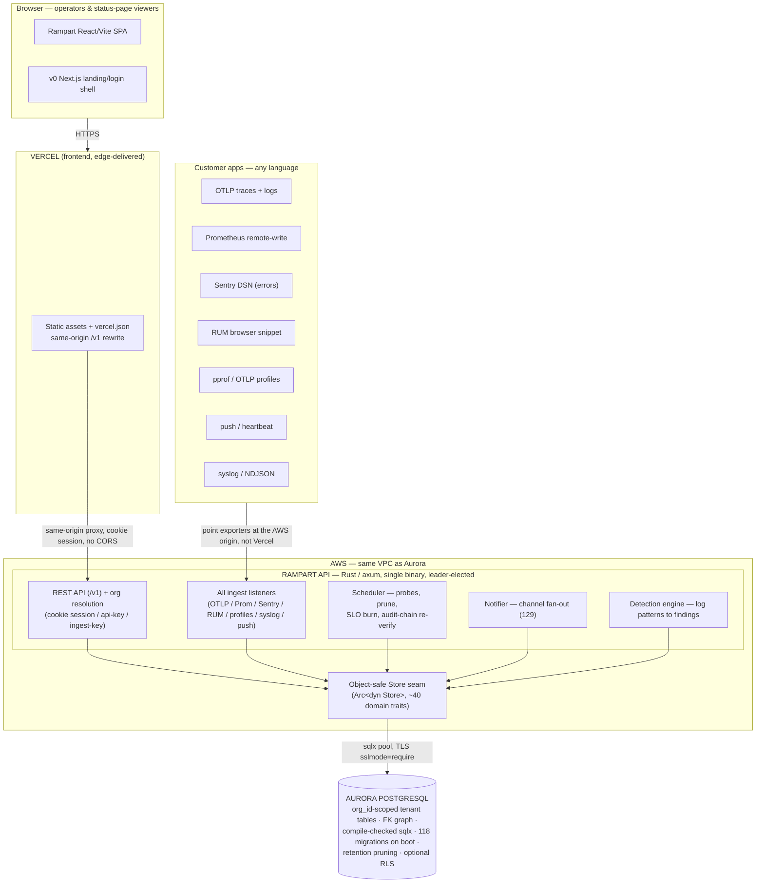

# Rampart — Devpost Submission

> **Paste-ready Devpost write-up** for the H0 Hackathon (deadline **2026-06-29
> 17:00 PDT**). Track: **Monetizable B2B App**. AWS Database: **Aurora
> PostgreSQL**. Frontend on **Vercel** (Vite/React SPA, same-origin `/v1` rewrite)
> with a **v0**-scaffolded Next.js landing shell.
>
> Every claim below maps to shipped code at **v0.156.0**. The deploy mechanics,
> the demo shot list, and the pre-submit checklist live in
> [`docs/HACKATHON.md`](HACKATHON.md) and [`deploy/aws-vercel.md`](deploy/aws-vercel.md);
> this file is the **Devpost copy** itself.

---

## Tagline

**One self-hosted, multi-tenant platform for observability *and* SIEM — uptime,
traces, logs, metrics, RUM, profiling, error tracking, on-call, status pages, and
security detections — in one Rust binary on Aurora PostgreSQL.**

---

## Inspiration

Every engineering and security team we know pays for a *stack* of overlapping
SaaS: Datadog for metrics, Sentry for errors, PagerDuty for on-call, a status-page
vendor, a separate SIEM for security detections, and an uptime checker on top.
That's five-plus bills, five-plus data silos, five-plus logins — and your
telemetry, often your most sensitive data, lives on someone else's servers.

We wanted one platform that does all of it, that you can run on infrastructure you
control, and that is **genuinely multi-tenant** — so a platform team can isolate
their internal orgs, and an agency or MSP can run observability for many client
orgs from a single install without their data ever crossing. Observability is
write-heavy, query-heavy, and retention-bound; that is exactly the workload a
relational engine like Aurora PostgreSQL is built to scale, while keeping the
foreign-key integrity our tenant routing and isolation depend on.

## What it does

Rampart is a self-hosted **observability *and* SIEM** platform. From one UI and
one Postgres-backed datastore it gives you:

- **Uptime monitoring** — 42 probe kinds (HTTP/keyword/JSON, TCP/ICMP/DNS/TLS,
  Postgres/MySQL/MSSQL/Redis/Mongo/Cassandra, gRPC/MQTT/Kafka/NATS/AMQP, SSH/SMTP
  banner checks, push/heartbeat, headless-browser keyword), each with intervals,
  retries, re-alerts, and an optional latency SLA.
- **Distributed tracing / APM** — OpenTelemetry OTLP/HTTP (JSON + protobuf, gzip)
  span ingest, a call-tree waterfall with self-time, a service dependency map
  (p95 + error edges), and per-operation APM rollups.
- **Structured logs** — OTLP log ingest plus **syslog (RFC 5424 / RFC 3164)** and
  **NDJSON** ingest, full-text body search (`tsvector`), live tail, and a volume
  histogram — correlated to traces by `trace_id`.
- **Metrics** — Prometheus-text/remote-write ingest, range queries, and threshold
  alert rules over any series.
- **Real-user monitoring (RUM)** — a drop-in browser `<script>` capturing Core Web
  Vitals (p75 LCP/INP/CLS), per-page drill-down, user/browser breakdowns, and JS
  error capture — linked back to traces.
- **Continuous profiling** — pprof / OTLP-profiles / folded-text ingest rendered
  as an interactive flamegraph, with a trace-span → profiling-window pivot.
- **Error tracking** — Sentry-SDK-compatible DSN ingest (point your existing DSN
  at Rampart; no Rampart SDK), group-by-fingerprint into issues, affected-users +
  volume histograms, and error↔trace links.
- **Security / SIEM** — a **detection engine** that raises *findings* from log
  patterns (case-insensitive body regex + attribute key/value match, with
  threshold/window/cooldown semantics and per-entity grouping), a **tamper-evident
  audit log** (HMAC hash chain recording config changes *and* auth events — login,
  failed login, 2FA failure) with in-UI integrity verification, **continuous
  audit-chain integrity monitoring** (the scheduler re-walks the chain ~hourly and
  raises a high-severity event if a row was edited/deleted/reordered), and **SIEM
  export** (audit + findings forwarded as JSON / CEF / LEEF over webhook, syslog
  UDP, or syslog TCP).
- **Alerting & response** — tier alert rules (error-rate, trace p95, log volume),
  metric rules, SLOs with rolling error budgets + fast-burn paging, escalation
  ladders with acknowledge/episode lifecycle, on-call rotations, public status
  pages with incidents + email subscribers, and fan-out to 129 notification
  channel kinds.
- **Compliance evidence** — **GDPR** data export + right-to-erasure
  (anonymize-in-place so the audit chain and FK graph stay intact) and a **SOC 2
  CC6 access-review report** (every `(org, member)` grant — role, member-since,
  last login, MFA status — as JSON or an auditor CSV download). Pulling either is
  itself audited.

Everything is **org-scoped**: per-org RBAC, per-org ingest credentials, an org
switcher, and — as defense-in-depth — flag-gated Postgres row-level security, so
tenants never see each other's data.

## How we built it

A **Rust (axum) single-binary backend** is the whole server: the REST API, *every*
ingest listener (OTLP traces/logs, Prometheus, Sentry DSN, RUM beacons, profiles,
push/heartbeats, syslog/NDJSON), the scheduler that runs the probes and the
slow-tick maintenance loops, and the notifier that fans alerts out to the channel
adapters — all coordinated by **Postgres advisory-lock leader election** so you can
run multiple replicas (one owns the scheduler, the rest serve the API) with
automatic failover and no duplicate probes or alerts.

Data lives in **Aurora PostgreSQL** via `sqlx` with **compile-time-checked queries**
(~480 `query!`/`query_as!`/`query_scalar!` macros against an offline `.sqlx` cache)
and 118 forward-only migrations that run on boot. The schema is deliberately
relational: an org-scoped foreign-key graph, composite per-org uniqueness, and
time-series retention pruning. Aurora PostgreSQL is wire-compatible with stock
Postgres, so running on it was a **connection-string change** (`?sslmode=require`),
not a rewrite — `sqlx` reads the TLS settings straight from the URL.

The data layer sits behind an **object-safe `Store` seam** — a super-trait composed
of ~40 per-domain sub-traits (`StoreMonitors`, `StoreLogs`, `StoreTraces`,
`StoreDetection`, `StoreAudit`, `StoreOrgs`, …). Callers bind to `Arc<dyn Store>`
and never touch a driver. This is the groundwork for additional backends; the P0
seam extraction is complete and a SQLite backend is the first per-driver target
(see *What's next* — we are **not** claiming "runs on 5 databases" today).

The **operator console** is a React/Vite SPA (today baked into the binary via
`rust-embed`); for the hosted submission it deploys to **Vercel** as a static
project with a `vercel.json` same-origin rewrite that proxies `/v1` to the
AWS-hosted API (so the session cookie flows with **zero CORS**), fronted by a
**v0-scaffolded Next.js** landing/login shell. (The Vercel/v0 layer is the
deploy-time front end per [`deploy/aws-vercel.md`](deploy/aws-vercel.md), not yet
in the repo.) The backend container
(`ghcr.io/pen-pal/rampart`) runs on AWS (App Runner / ECS Fargate / EC2) in the
same VPC as Aurora.

## Architecture

## Challenges we ran into

- **Tenant isolation across *every* read and write path** without breaking the
  single-org install. We threaded an `OrgId` through the repository layer, added
  `*_all`/unscoped siblings only where a system loop legitimately needs them,
  issued per-org ingest credentials, and added a *reversible* Postgres row-level
  security layer (off by default, owner-bypass, no schema lock-in) as
  defense-in-depth — so a misconfigured app path can't leak across tenants even if
  the app-level scope is wrong.
- **Inverting a deeply Postgres-coupled data layer behind an object-safe trait.**
  The codebase had ~440 `pool: &DbPool` function signatures and ~690 free-fn call
  sites. A few primitives blocked object-safety (a generic VAPID get-or-create
  closure, `IpNetwork` leaking into a public signature, generic-executor upserts).
  We refactored each — e.g. the audit `NewEntry` now carries `std::net::IpAddr`
  and converts to `IpNetwork` once *inside* `insert`, so the tamper-evident hash
  chain stays **byte-identical** to pre-refactor rows — and landed the seam in
  small, zero-behavior-change slices.
- **Keeping the tamper-evident audit chain honest under refactors and at rest.**
  The HMAC hash chain has to survive both the seam refactor (above) and live
  tampering. We added continuous chain re-verification on a leader-only slow-tick
  that surfaces a broken chain two ways — a high-severity self-telemetry log *and*
  a forward `audit.chain_verify_failed` event.
- **Security hardening for a tool that takes user-defined targets.** SSRF guard on
  every outbound probe and webhook (blocks cloud-metadata / internal ranges),
  AES-256-GCM encryption-at-rest for channel + SMTP secrets (fail-closed when a key
  is set), and trusted-proxy-aware client-IP resolution so per-client rate limits
  and audit IPs can't be spoofed via `X-Forwarded-For`.
- **Vercel frontend ↔ AWS API origin with no product code change.** The SPA assumes
  a same-origin API and the API intentionally does *not* send
  `Access-Control-Allow-Credentials`, so a cross-origin call can't carry the
  session cookie. The clean answer was a `vercel.json` same-origin `/v1` rewrite —
  no CORS, no code change. (Ingest endpoints stay pointed at the AWS origin
  directly, never proxied through Vercel.)

## Accomplishments we're proud of

- **One Rust binary** that ingests OpenTelemetry, Prometheus, Sentry, RUM,
  profiles, and syslog *simultaneously*, probes 42 monitor kinds, runs SIEM
  detections, pages on-call, and serves public status pages — all tenant-isolated
  on a deliberately deep relational schema, with leader-elected HA.
- **Full multi-tenancy that actually shipped** (Phases 1–5): orgs, org members,
  per-org RBAC, an org switcher, OIDC→org claim mapping, per-org ingest
  credentials, and flag-gated Postgres RLS — not a flag on a single-user tool.
- **A compliance evidence story most observability tools don't have**: GDPR
  export + right-to-erasure that preserves the audit chain, plus a SOC 2 CC6
  access-review report (JSON + auditor CSV).
- **A working end-to-end demo with *real* data.** The `examples/` stacks bring up a
  live system — a real instrumented app's traces/logs/metrics/profiles/errors, a
  real browser's RUM, Prometheus remote-write, Alertmanager-driven incidents,
  genuinely flapping monitors, and two isolated orgs — so the demo shows real
  telemetry, not seeded rows.

## What we learned

- **Aurora PostgreSQL wire-compatibility is the quiet superpower.** Because the
  depth was in the *schema* (not in a driver), moving onto a managed, auto-scaling
  cluster cost one connection string. The right place to invest was the relational
  data model, not a database abstraction.
- **An object-safe seam is harder than it looks, and worth it.** The blocking work
  wasn't the 690 call sites — it was the handful of primitives that weren't
  object-safe. Doing it as zero-behavior-change slices (each verified by the
  existing integration suites) kept a high-churn refactor from ever breaking main.
- **Tenant isolation must be enforced *below* the app, not only in it.** App-level
  `OrgId` scoping is necessary but a single missed `WHERE org_id = $1` is a leak;
  reversible RLS turns that into defense-in-depth.
- **A tamper-evident chain only stays trustworthy if you keep proving it.** Manual
  verification is theater if no one runs it — proactive re-verification is what
  makes the integrity claim real.

## What's next

- **Aurora read-replica routing** for the query tier — point reads at a reader
  endpoint while writes hit the writer.
- **Promote RLS from defense-in-depth to the enforced default** (the multi-tenancy
  Phase 6 enforcement flip).
- **A SQLite backend behind the now-complete `Store` seam** for single-binary /
  homelab installs — the first per-driver backend (Postgres stays the
  full-feature reference tier; other engines are deliberately a capability subset,
  not parity).
- **Per-tenant data-retention tiers** and a **hosted multi-org SaaS** built on the
  same binary.

## Built with

- **Languages:** Rust, JavaScript (React/JSX), SQL
- **Backend:** axum, Tokio, `sqlx` (compile-time-checked queries, offline `.sqlx`
  cache), `rust-embed` (frontend baked into the binary)
- **Database:** **Aurora PostgreSQL** (Serverless v2), 118 `sqlx` migrations on
  boot, `sslmode=require`
- **Frontend:** Vite, React (embedded in the binary today); deploys to **Vercel**
  for the hosted submission (static project + `vercel.json` same-origin `/v1`
  rewrite); **v0**-scaffolded Next.js landing shell
- **Hosting:** AWS App Runner / ECS Fargate / EC2 in Aurora's VPC; container
  `ghcr.io/pen-pal/rampart`; Helm/OCI chart for Kubernetes
- **Wire protocols ingested:** OpenTelemetry (OTLP/HTTP traces + logs + profiles),
  Prometheus (text / remote-write), Sentry DSN, pprof, RFC 5424 / RFC 3164 syslog,
  NDJSON, a public push/heartbeat endpoint
- **Security / crypto:** HMAC audit hash chain, AES-256-GCM secrets-at-rest, p256 +
  aes-gcm Web Push (RFC 8291), TOTP 2FA, OIDC SSO, SSRF guard
- **SIEM interop:** JSON / CEF / LEEF export over webhook, syslog UDP, syslog TCP

---

### Which AWS Database did you use? (Devpost field)

> **Aurora PostgreSQL.** Rampart's entire data model is relational by design —
> org-scoped tenant tables with a foreign-key graph, composite per-org uniqueness
> constraints, transactional alert routing, and time-series retention pruning. We
> run on Aurora PostgreSQL via a standard connection string with
> `sslmode=require`; all 118 migrations apply automatically on boot. Because
> Aurora PostgreSQL is wire-compatible with stock Postgres and we use `sqlx` (which
> reads TLS settings straight from the connection URL), moving to Aurora was a
> connection-string change, not a rewrite — the depth is in the schema, which
> Aurora's Serverless v2, storage auto-scaling, and read-path scaling are built
> for. We deliberately did **not** use a key-value store (Aurora DSQL / DynamoDB):
> the FK graph, joins, composite uniqueness, and transactional routing are the
> opposite of a KV fit.

### Submission links (fill after deploy)

- **Repo:** <https://github.com/pen-pal/rampart>
- **Live frontend (Vercel Project Link):** _______________
- **Vercel Team ID:** _______________
- **Demo video (YouTube, < 3 min):** _______________
- **Architecture diagram:** the Mermaid block above, exported to PNG/SVG
- **AWS-DB-usage screenshot:** Aurora console (engine, Available, Monitoring) +
  redacted `DATABASE_URL`

> Deploy steps, the demo shot list, and the full pre-submit checklist:
> [`docs/HACKATHON.md`](HACKATHON.md) and [`deploy/aws-vercel.md`](deploy/aws-vercel.md).
