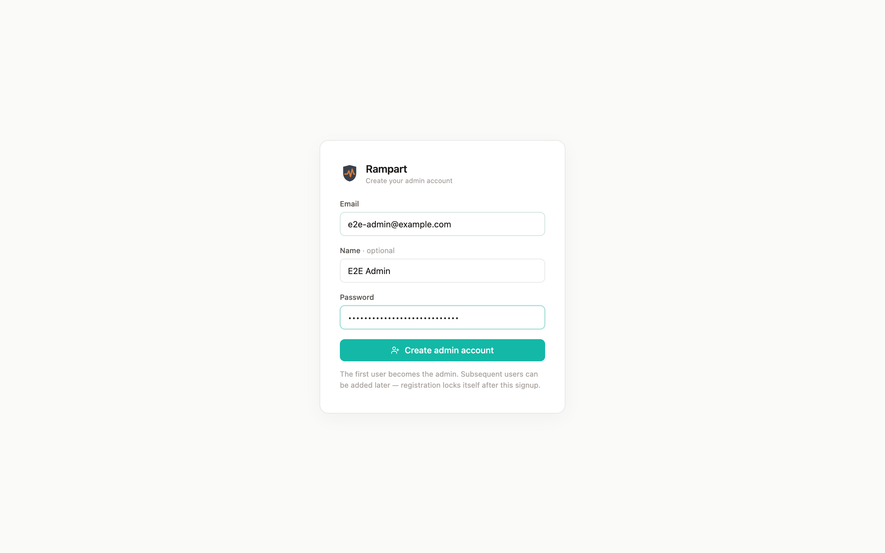
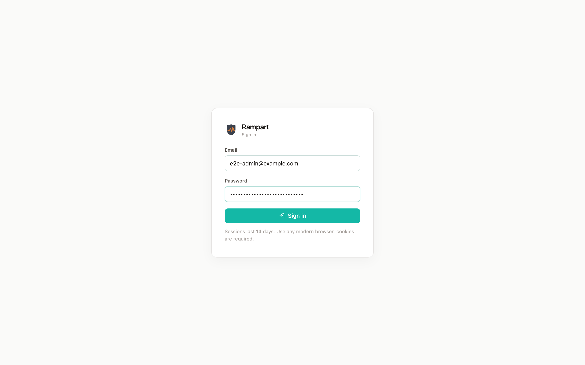
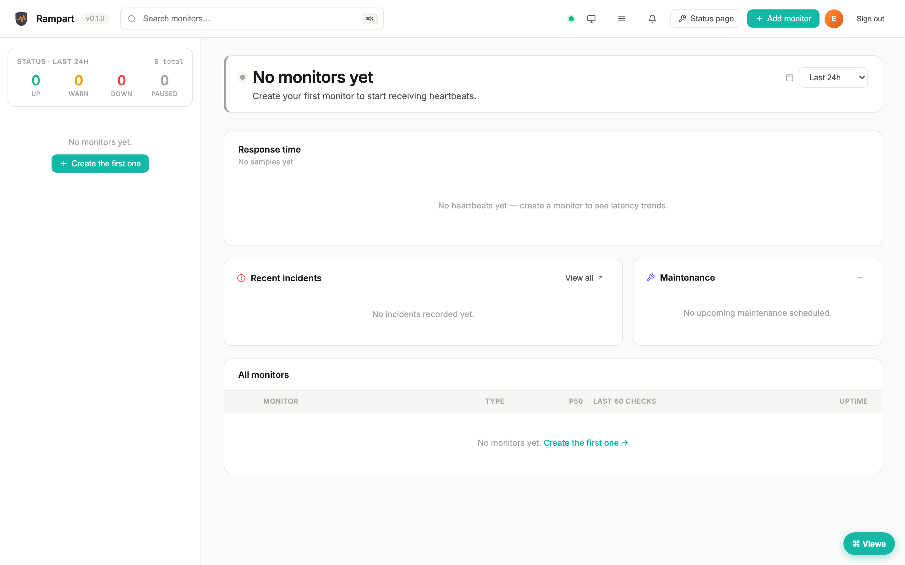
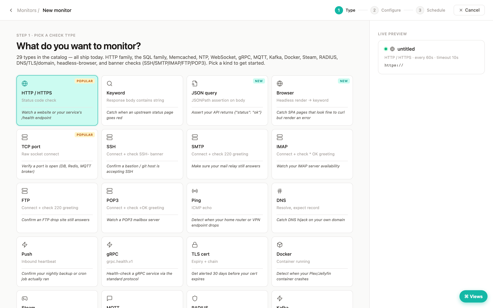
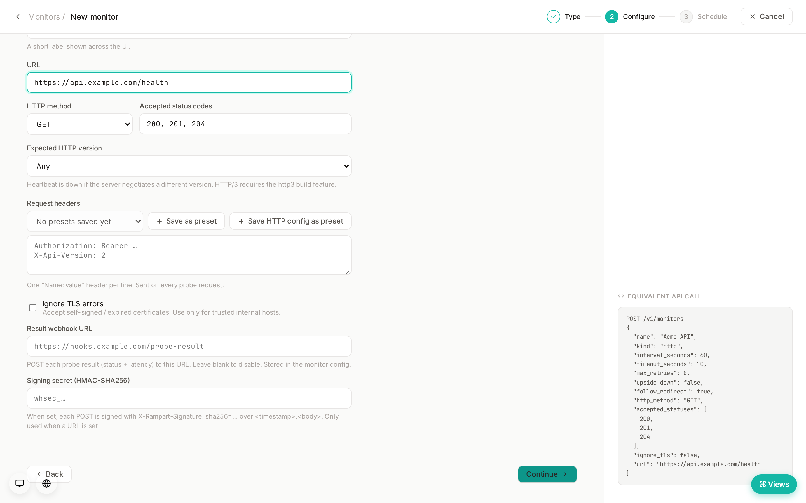
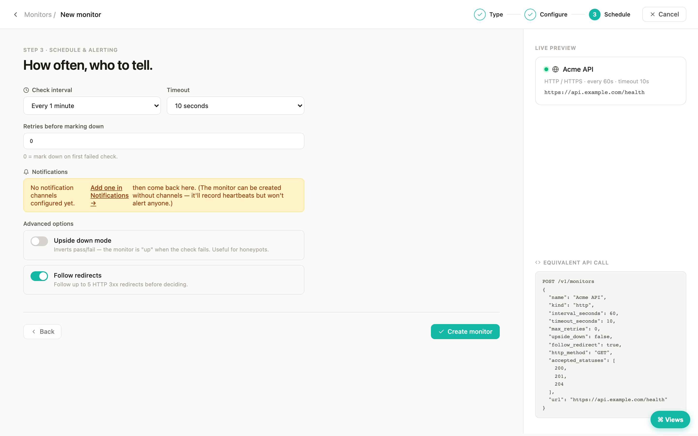
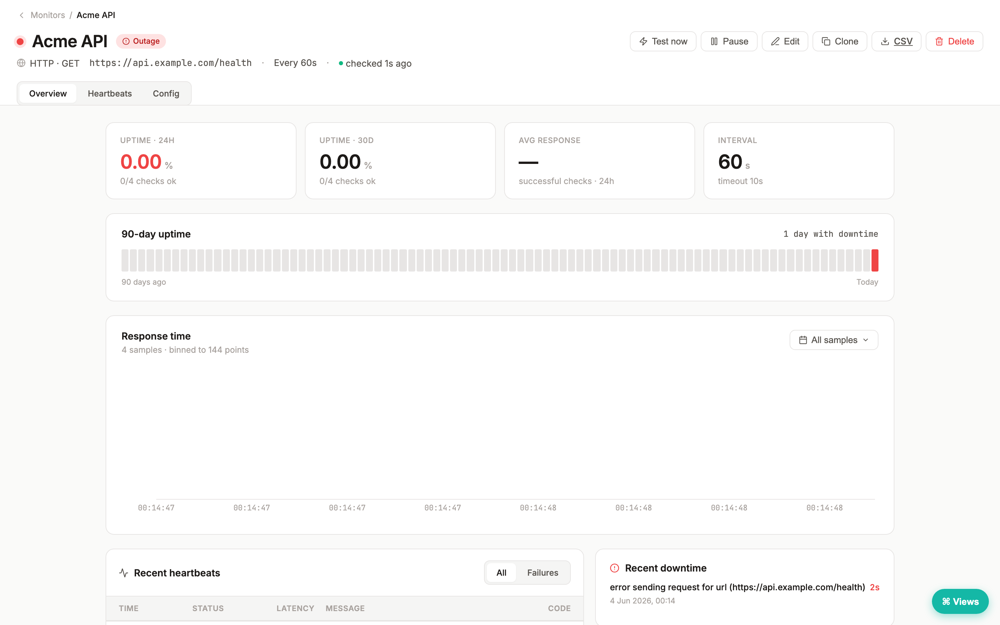
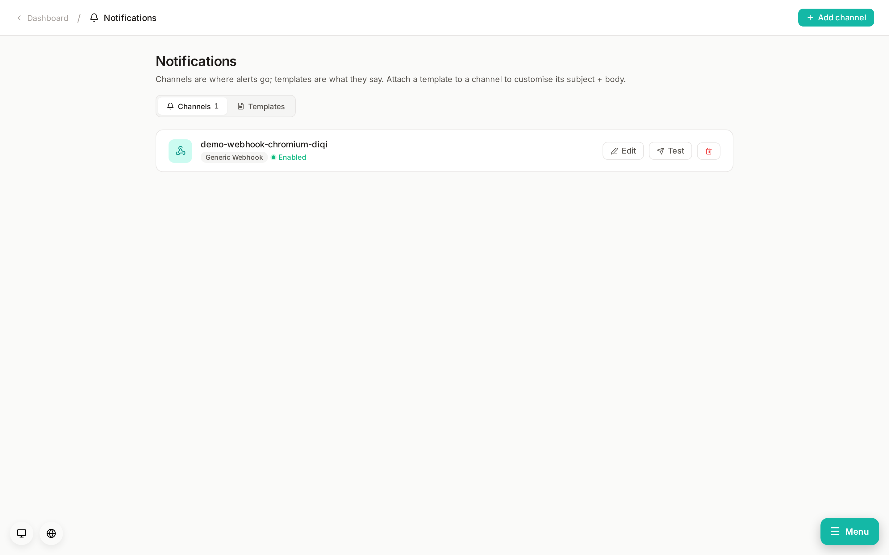
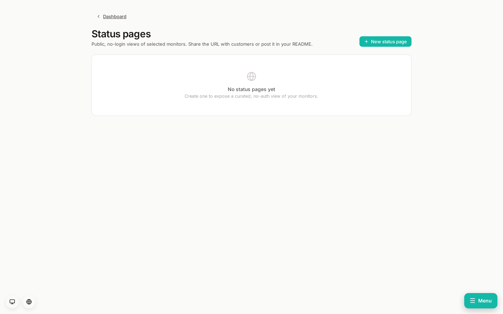
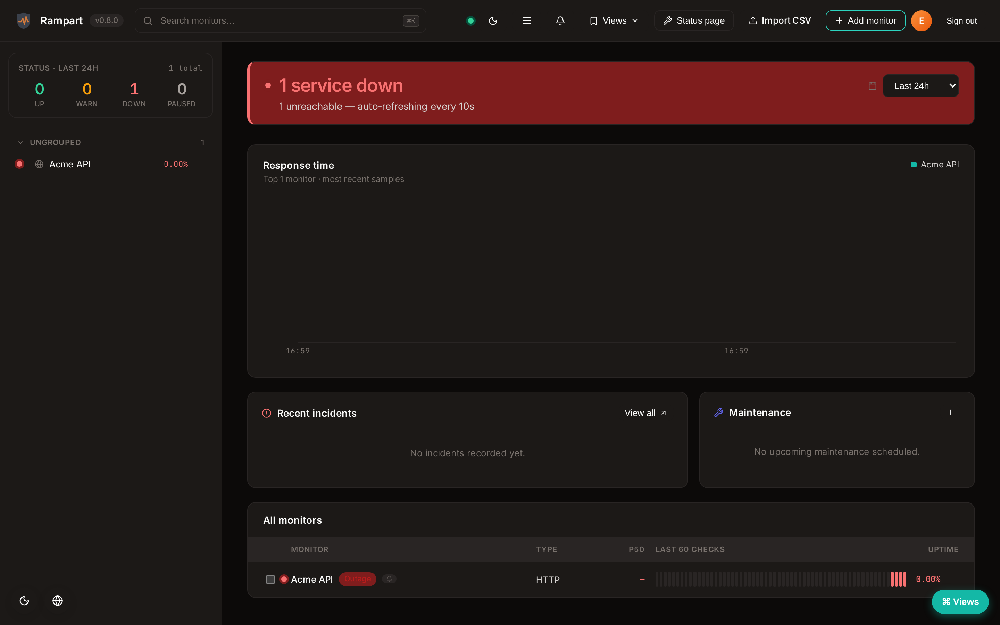

# Rampart — first 10 minutes

This walkthrough takes you from a fresh Rampart install to a monitored production endpoint with notifications and a public status page. Every screenshot is generated from the running app (see [`docs/assets/screenshots/README.md`](assets/screenshots/README.md) for the regenerator), so what you see here is what you'll actually see on screen.

> **Prerequisites.** A running `rampart-api` binary bound to a port you can reach in a browser (default `:3000`), with a Postgres instance reachable via `DATABASE_URL`. The [README quick-start](../README.md#-quick-start) covers two ways to get there: a `cargo run` from source, or `docker compose up`. Pick one before starting here.

---

## Step 1 — Create the admin account

The first time you visit Rampart at `http://localhost:3000` you'll see the **first-run setup screen**. There's no admin user yet, so the only thing the app lets you do is create one.

Fill in:

| Field      | Notes                                                                                                |
| :--------- | :--------------------------------------------------------------------------------------------------- |
| **Email**  | Used to sign in. Stored in the `users` table. Not surfaced anywhere external.                         |
| **Name**   | Display name shown in the dashboard chrome and in audit-log entries.                                  |
| **Password** | Minimum 8 characters. Hashed with Argon2 before it touches the database (see `rampart-api::auth`). |

Click **Create admin account**. You land on the empty dashboard.

> **Why a single admin?** Rampart isn't multi-tenant — there are no workspaces or organisations. Multiple users live behind one admin account; granular RBAC is intentionally out of scope (see [`docs/DESIGN-ORIGINAL.md`](DESIGN-ORIGINAL.md) for the rationale).

---

## Step 2 — Sign in afterwards

Once an admin exists, future visits land on the **sign-in screen**:

Your email plus password gets you in. If you've enabled 2FA the next prompt asks for a TOTP code; recovery codes are accepted in the same field.

---

## Step 3 — The empty dashboard

Right after setup the dashboard is empty — no monitors, no incidents, nothing to chart. The header still loads with the brand mark, search bar, theme toggle, and notification bell so you can confirm the UI is wired up end-to-end:

Click **+ Add monitor** in the header (or hit `n`) to open the new-monitor wizard.

---

## Step 4 — Pick a probe kind

Rampart ships **29 probe kinds**. The wizard's first step is picking which one — each card has a one-line description and an example target so you don't have to guess what "RADIUS" or "MQTT" expects.

For this walkthrough we'll create an **HTTP** monitor — the default and the most common case. Click **Continue**.

> **Picking the right kind.** "Is the website up?" → HTTP. "Is the keyword on the page?" → Keyword. "Is a JSON value still what I expect?" → JsonQuery. "Is the cert about to expire?" → TLS. The full list is documented inline in the wizard cards and in [`backend/HACKING.md`](../backend/HACKING.md).

---

## Step 5 — Name and target URL

Step 2 collects the bits that change per monitor — what to call it and what to probe:

| Field      | Notes                                                                                                       |
| :--------- | :---------------------------------------------------------------------------------------------------------- |
| **Name**   | Free text. Shown in the dashboard list, alerts, and on the public status page.                              |
| **URL**    | Full URL including scheme. HTTPS uses `webpki-roots` for cert validation by default; opt out per-monitor.   |
| **Method** | Defaults to `GET`. Switch to `POST` / `PUT` / etc. for endpoints that demand it.                            |
| **Accept** | Status codes treated as "up". Defaults to `2xx`. Add `3xx` to count redirects as healthy.                   |

Click **Continue**.

---

## Step 6 — Schedule and thresholds

Step 3 controls cadence, retries, and failure semantics:

| Field                  | Default | Notes                                                                                                              |
| :--------------------- | :------ | :----------------------------------------------------------------------------------------------------------------- |
| **Interval**           | 60s     | How often to fire the probe. The scheduler jitters each interval ±10% so a fleet of monitors doesn't synchronise.   |
| **Timeout**            | 10s     | Hard cap on the probe runtime. Times out → heartbeat `Down` with `timeout`.                                          |
| **Retries before down** | 3       | Soft floor: a single failed probe doesn't open an incident — it's the *n*-th consecutive failure that flips state. |
| **Acceptable latency** | 1500ms  | Latency above this still counts as "up" but downgrades the heartbeat to a `Slow` (yellow) state.                    |

Click **Create monitor**. You're taken to the monitor detail view.

---

## Step 7 — Watch heartbeats land

The detail view shows the **latest heartbeat**, a **response-time chart**, the **incident history**, and the **timeline strip** in the page header. Within an interval (and immediately if you hit **Test now**), the first heartbeats show up:

Every heartbeat is one row in the `heartbeats` table with status (`Up` / `Down` / `Slow`), latency in ms, an HTTP status code (where applicable), and the response message. The SSE stream pushes them to the dashboard so the cell colour flips without a refresh.

---

## Step 8 — The populated dashboard

Back on the dashboard, the new monitor is in the list with a live status indicator, last latency, last status code, and bell badge (grey until you attach a notification channel — next step):

The table is searchable, sortable, and filterable by folder / tag. The mixed-state banner at the top reflects the worst-state monitor — so a single page-load tells you whether anything is on fire.

---

## Step 9 — Add a notification channel

Channels live under **Settings → Notifications** (or `#/notifications`). Rampart ships **128 channel adapters** — chat platforms, SMS, email, webhook, web push, and the long-tail integrations like Honeybadger, PagerDuty, Opsgenie, Splunk On-Call, Zulip, ntfy, and many more.

The walkthrough creates a single **webhook** channel pointed at a placeholder URL. In a real setup you'd point it at your incident-management tool, your team's chat, your phone, or all of the above. Channels are attached to monitors individually (one channel can fan out to many monitors; one monitor can hit many channels), and the bell badge in the dashboard turns teal once at least one channel is attached.

> **Test before you trust.** Every channel has a **Test** button that sends a synthetic alert through the real provider. Run it once when you add the channel so you catch token typos and IP-allowlist misconfigurations before a real outage does.

---

## Step 10 — Publish a public status page

Status pages let you (and your users) see the current state of one or more monitors from a single URL. They're public by default and accept a custom domain via the `DOMAIN` field:

Choose which monitors appear, group them by **section** (Production, Staging, Internal, etc.), set a title and subtitle, and Rampart serves the page from a fixed slug. Visitors get an auto-refreshing view powered by the same SSE stream the dashboard uses, so the page reflects state changes within a second.

> **Dependency-aware.** If you mark monitor B as depending on monitor A, the status page suppresses B's "down" badge during A's outage and instead notes "downstream of A". The same logic suppresses duplicate notification fan-out.

---

## Step 11 — Dark theme

The dashboard tracks `prefers-color-scheme` by default; the toggle in the header is a manual override:

Both themes are first-class — the design tokens are mirrored in `--surface`, `--text`, `--accent` CSS custom properties so the dark theme isn't a desaturation of the light one.

---

## Where to go next

| Want to…                                          | Read…                                                       |
| :------------------------------------------------ | :--------------------------------------------------------- |
| Add your own probe kind                           | [`backend/HACKING.md`](../backend/HACKING.md)              |
| Add your own notification channel                 | [`docs/NOTIFICATIONS.md`](NOTIFICATIONS.md)                |
| Deploy to a server / container / Kubernetes       | [`docs/SETUP.md`](SETUP.md)                                |
| Understand the design choices (why not X, why Y)  | [`docs/DESIGN-ORIGINAL.md`](DESIGN-ORIGINAL.md)            |
| Cut a release                                     | [`docs/RELEASING.md`](RELEASING.md)                        |
| Track changes                                     | [`CHANGELOG.md`](../CHANGELOG.md)                          |
