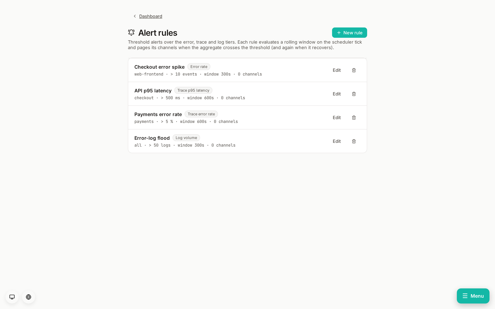

# Telemetry alert rules

Threshold alerts over the observability tiers (errors / traces / logs),
complementing the existing **metric rules** (which watch ingested Prometheus
metrics) and the error tier's built-in new/regressed-issue paging.

## Model

One table, `telemetry_alert_rules` (migration 0081), a sibling of
`metric_rules`. It reuses the metric-rule state machine wholesale —
`rampart_core::metric_rule::{RuleOp, rule_transition}` plus the `for_seconds`
sustain window — so the pending → firing → resolve logic and the restart-safe,
no-double-page dedup (persisted `breach_since` / `firing_at`) are identical.
The only tier-specific piece is *what value is compared*: a windowed aggregate
selected by the rule's `kind`.

| kind | aggregate over the window | optional scope (`target`) |
|---|---|---|
| `error_rate` | COUNT of error events | project name |
| `trace_latency` | p95 span `duration_ms` | service name |
| `trace_error_rate` | percent of spans with `status_code = 2` | service name |
| `log_volume` | COUNT of logs at/above `min_level` | service name (+ `match_text` body substring) |
| `profile_samples` | SUM of profile `sample_count` | service name |

`target` empty = no scope filter (all projects/services). `op` + `threshold`
compare the aggregate (`gt`/`lt`/`gte`/`lte`); `window_seconds` is the rolling
window; `for_seconds` is the sustain window before firing (0 = fire on first
breach). Ratio/percentile kinds with no rows in the window report "no data" and
resolve rather than fire (matching the metric tier's staleness stance);
count kinds report 0.

## Evaluation

The scheduler's slow tick calls `rampart_db::telemetry_rules::evaluate_tick`
right after the metric-rule check. Per enabled rule it runs the tier aggregate,
asks `rule_transition` what changed, persists the new state, and returns
Fire/Resolve transitions. The scheduler fans each out to the rule's
`channel_ids` as a `TelemetryRuleFired` / `TelemetryRuleResolved` notification
event whose body carries the observed value, threshold and window.

## API + UI

CRUD at `/v1/telemetry-rules` (editor slice; readonly GETs). The **Alert rules**
view (`#/alert-rules`) lists rules and offers an inline create/edit form —
kind, scope, comparison, threshold, window, sustain, the log-only severity +
body filters, and the notification-channel multiselect.

## Follow-ups (deferred)

- Per-rule cooldown / digest (today dedup is one page per breach + one per
  recovery, same as metric rules).
- More aggregates (error-rate as a ratio of total events; trace throughput;
  apdex). The `kind` enum + `observe()` match are the extension points.
- Anomaly/baseline rules instead of static thresholds.
