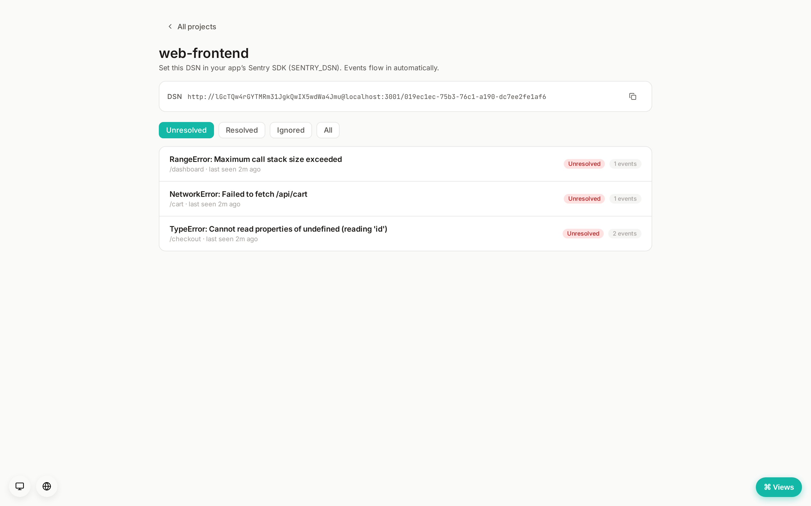

# Design: error & exception tracking (Tier 1)



Status: **shipped** (v0.8.0). This page is the design spec; the feature is live.
See [`docs/ROADMAP.md`](../ROADMAP.md) for where this sits.

Goal: capture exceptions from running applications, group them into **issues**
by fingerprint, dedupe the flood, alert on new/regressed issues over the
existing notification spine, and show stack traces in the dashboard. A
self-hosted Sentry-lite that drops into the rest of Rampart.

## The decision that shapes everything: be Sentry-DSN compatible

We accept events on a **Sentry-compatible ingest endpoint** (the store/envelope
protocol + DSN scheme) rather than inventing our own wire format.

**Why:** the official Sentry SDKs (`@sentry/browser`, `sentry-python`,
`sentry-go`, `sentry` for Rust, etc.) are mature, widely adopted, and
configured by a single **DSN** string. If Rampart speaks their protocol, a user
points `SENTRY_DSN` at their Rampart instance and is done — **we ship zero
SDKs** and inherit the entire ecosystem on day one. This is the same move
GlitchTip made to bootstrap.

**Cost:** we implement a *subset* of the Sentry ingest protocol. That's bounded
and well-documented; we do not implement Sentry's full server.

### DSN + auth model

DSN format (Sentry-standard):
```
https://<public_key>@<rampart-host>/<project_id>
```
- The **public key** is not a secret — Sentry SDKs embed it in browser JS by
  design. So we store it in plaintext and match on it at ingest; security comes
  from per-project rate limiting and optional allowed-origin/`environment`
  filters, not from key secrecy.
- Ingest auth arrives as the `X-Sentry-Auth` header (or `?sentry_key=` query
  param for the browser transport). We parse out `sentry_key`, look up the
  project, and accept.

### Ingest endpoints (subset)

- `POST /api/{project_id}/envelope/` — the modern envelope transport (newline-
  delimited: envelope header, then item header + item payload pairs). We handle
  the `event` item type; we accept-and-ignore unknown item types (e.g.
  `transaction`, `session`) so SDKs don't error. Supports `gzip`/`deflate`
  content-encoding.
- `POST /api/{project_id}/store/` — the legacy single-event transport, for
  older SDKs. Same event schema, no envelope wrapper.
- Both return Sentry's expected `{ "id": "<event_id>" }` on success and a `429`
  with `Retry-After` when rate-limited (SDKs honor this and back off).

We parse the fields we use and keep the rest of the event JSON verbatim in a
JSONB column, so nothing is lost and the detail view can show whatever the SDK
sent.

## Concepts

- **Project** — a namespace for one application's errors (`web`, `api`,
  `worker`). Holds the DSN public key, platform, and retention. Projects are
  *not* tenancy — they're folders within the single instance, like monitor
  groups.
- **Event** — one captured occurrence: timestamp, level, exception type +
  value, stack frames, culprit/transaction, environment, release, server name,
  request/user/tags/extra context, platform, raw payload.
- **Issue** — a group of events sharing a fingerprint. The unit operators
  actually work with: title, culprit, level, status (unresolved / resolved /
  ignored), first/last seen, event count, optional assignee.

## Fingerprinting (grouping)

Same bug → same issue, so a crash loop is one row, not 10,000. Default
algorithm (Sentry-like):

1. If the SDK supplied an explicit `fingerprint`, hash that.
2. Else if there's a stack trace: hash `exception.type` + the **in-app** frames
   normalized to `(module, function)` — **drop line numbers and absolute
   paths** so a shifted line or a different deploy path doesn't fork the issue.
3. Else (message-only event): hash `exception.type` + a normalized message
   (strip obvious variable bits — numbers, UUIDs, hex — to a placeholder).

The fingerprint hash is unique per project. Grouping logic is a **pure,
unit-tested function in `rampart-core`** (no DB), mirroring how the synthetic
and cron parsers are structured.

## Storage (migration adds three tables)

```
error_projects
  id              UUID PK
  name            TEXT NOT NULL
  slug            TEXT NOT NULL              -- used in the DSN path is `id`; slug for UI/url
  public_key      TEXT NOT NULL UNIQUE       -- the DSN public key (not secret)
  platform        TEXT                       -- "javascript" | "python" | ...
  retention_days  INT  NOT NULL DEFAULT 30
  created_at      TIMESTAMPTZ NOT NULL DEFAULT now()

error_issues
  id              UUID PK
  project_id      UUID NOT NULL REFERENCES error_projects(id) ON DELETE CASCADE
  fingerprint     TEXT NOT NULL              -- the group hash
  title           TEXT NOT NULL              -- e.g. "TypeError: undefined is not a function"
  culprit         TEXT                       -- where it happened (function / route)
  level           TEXT NOT NULL              -- error|warning|info|fatal
  status          TEXT NOT NULL DEFAULT 'unresolved'  -- unresolved|resolved|ignored
  first_seen      TIMESTAMPTZ NOT NULL DEFAULT now()
  last_seen       TIMESTAMPTZ NOT NULL DEFAULT now()
  times_seen      BIGINT NOT NULL DEFAULT 0
  assignee        UUID REFERENCES users(id) ON DELETE SET NULL
  -- one issue per (project, fingerprint):
  UNIQUE (project_id, fingerprint)

error_events
  id              UUID PK                    -- the event_id returned to the SDK
  issue_id        UUID NOT NULL REFERENCES error_issues(id) ON DELETE CASCADE
  project_id      UUID NOT NULL REFERENCES error_projects(id) ON DELETE CASCADE
  ts              TIMESTAMPTZ NOT NULL
  level           TEXT NOT NULL
  message         TEXT
  exception_type  TEXT
  culprit         TEXT
  environment     TEXT
  release         TEXT
  server_name     TEXT
  stacktrace      JSONB                      -- normalized frames
  context         JSONB                      -- tags + user + request + extra + the raw event
  INDEX (project_id, issue_id, ts DESC)
  INDEX (project_id, ts DESC)
```

Ingest is the hot path and must be **single-statement and idempotent on the
group**, mirroring the escalation-episode pattern:

```sql
-- upsert the issue, bump counters atomically, return its id + whether it was new
INSERT INTO error_issues (id, project_id, fingerprint, title, culprit, level, times_seen, last_seen)
VALUES ($1,$2,$3,$4,$5,$6, 1, now())
ON CONFLICT (project_id, fingerprint) DO UPDATE
  SET times_seen = error_issues.times_seen + 1,
      last_seen  = now(),
      -- a resolved issue seeing a new event is a regression → reopen
      status     = CASE WHEN error_issues.status = 'resolved' THEN 'unresolved' ELSE error_issues.status END
RETURNING id, (xmax = 0) AS is_new, status, (… was_resolved …);
```
Then insert the event row referencing the issue. (`xmax = 0` distinguishes
insert from update — the standard Postgres upsert "is new?" trick.)

High volume → a **prune task** drops `error_events` older than the project's
`retention_days`, exactly like `metric_samples` pruning. Issues persist (they're
small); only the event detail ages out.

## Alert wiring (reuse the spine)

Errors flow through the **existing notifier**, not a parallel alert system:

- **New issue** (the upsert reported `is_new`) → emit an event to the notifier
  with a new `EventKind::ErrorNew`. Routes to the project's attached channels.
- **Regression** (upsert flipped `resolved → unresolved`) →
  `EventKind::ErrorRegressed`.
- Reuse channel templates, quiet hours/digest rules, the delivery log, and —
  stretch — let a project reference an **escalation policy** so a fatal error
  can climb the on-call ladder just like a Down monitor.
- Noise control: alert on **new** and **regressed** issues, never on every
  event of an already-known issue. (A later "spike" rule — N events in M
  minutes — is a natural follow-up but out of v1.)

## Symbolication (source maps)

Minified JS frames (`main.abc123.js:1:48210`) are unreadable. Upload the build's
**source map** and Rampart resolves frames to the original function / file / line
on read — server-side, so nothing changes in how SDKs send events.

- **Store** (migration `0086`, table `source_maps`): keyed by
  `(project_id, release, filename)`, where `filename` is the **basename** of the
  minified file. The map JSON lives in a `jsonb` column.
- **Capture:** the ingest parser now keeps each frame's `colno` (a fully-minified
  bundle is one line, so the column is what disambiguates — line-only lookup is
  useless there). Old events without a column resolve approximately or not at all.
- **Resolve:** on `GET /v1/error-issues/{id}/events`, for each frame whose file
  has an uploaded map for the event's `release`, the `sourcemap` crate maps
  `(line, col)` → original, attached as a `resolved` block on the frame (the
  minified original is preserved alongside). Maps are cached per `(release, file)`
  for the page — one lookup per unique file, not per frame.
- **Manage:** upload / list / delete maps per project in the dashboard (paste the
  `.js.map` contents). Native (DWARF) symbolication is a deferred follow-up;
  this v1 covers the common JS source-map case.

## API surface

Admin (session-authed, editor/admin, mounted under `/v1`):
- `GET/POST /v1/error-projects`, `PATCH/DELETE /v1/error-projects/{id}` —
  project CRUD; create mints the public key and returns the assembled DSN.
- `GET /v1/error-projects/{id}/issues?status=&sort=` — issue list (sort by
  last_seen / times_seen / first_seen).
- `GET /v1/error-issues/{id}` — issue detail + recent events.
- `POST /v1/error-issues/{id}/resolve` | `/ignore` | `/unresolve` — status
  changes (audit-logged).

Ingest (DSN-keyed, not session — its own auth path, rate-limited):
- `POST /api/{project_id}/envelope/`
- `POST /api/{project_id}/store/`

OpenAPI: hand-edit `docs/openapi.yaml` for the admin routes; document the
ingest endpoints as Sentry-compatible.

## Dashboard

A new `#/errors` view, mirroring the Escalations/Metrics views:
- Projects list → pick a project → issues list (status filter, sort, search by
  title) → issue detail (rendered stack trace, breadcrumb trail, event timeline,
  per-issue stats (users affected / release / environment), tags/context,
  Resolve / Ignore buttons, copyable DSN on the project).
- Breadcrumbs: the SDK trail (`breadcrumbs.values[]`, or a bare `breadcrumbs[]`
  from older SDKs) kept verbatim in the event `context` is rendered as a
  category/message/level/time timeline on the latest event.
- Assignee: an issue can be assigned to a user from the detail header
  (`POST /{id}/assign`); the picker is fed by an editor-visible directory
  (`GET /v1/error-issues/assignable-users`, id/name/email only).
- New nav entry; lazy-loaded view; `error.*` i18n keys (English, others
  fall back via `t()`).

## Scope: v1 vs later

**v1 (this build):**
- Sentry-compatible `envelope` + `store` ingest for **error/exception events**
  (accept-and-ignore transaction/session items).
- Projects CRUD + DSN; per-project rate limit + retention.
- Fingerprint grouping (explicit → stack → message), client override.
- Issues: list, detail, resolve/ignore/unresolve, regression reopen.
- New-issue + regression alerts via the notifier; event prune task.

**Later (follow-ups, explicitly deferred):**
- Source-map support (de-minify JS stack traces).
- Breadcrumbs / session timeline UI; user-impact counts.
- Full-text search over events.
- Spike/rate alert rules; issue assignment workflow.
- Performance/transaction events → that's the **APM/trace tier**, not here.

## Architecture fit (mirrors the existing pattern, no new crate)

- `rampart-core`: `error.rs` — domain types + the pure fingerprint function +
  unit tests; `ErrorProjectId` / `ErrorIssueId` ids; new `EventKind` variants
  in the notifier event enum.
- `rampart-db`: `error_tracking.rs` — projects CRUD, the atomic issue-upsert +
  event insert, issue queries, prune.
- `rampart-api`: `routes/error_tracking.rs` (admin) + `routes/error_ingest.rs`
  (the Sentry-compatible DSN-keyed ingest, with its own extractor/rate-limit,
  mounted at root `/api/...` like the existing public ingest paths).
- `rampart-notifier`: handle the two new `EventKind`s (wording + dispatch).
- Migration: the three tables above + a `channel_kind`-style nothing (no enum
  change needed).
- Frontend: `Errors.jsx` view + api.js `errorProjects` / `errorIssues` methods
  + router/nav/i18n.

**Storage stance:** Postgres + retention pruning carries this at small-team
volume — no new datastore, consistent with the one-binary principle. If a very
high-volume instance outgrows it, an opt-in event-store backend is a future
lever, never the default.

**Dependency stance:** the ingest protocol (envelope parsing, gzip) needs no
new heavy deps — `serde_json` + the existing `reqwest`/`flate2`-class crates in
the tree cover it; the fingerprint hash uses the `sha2` already vendored. No
C/crypto-toolchain deps, per [`docs/DEPENDENCIES.md`](../DEPENDENCIES.md).
