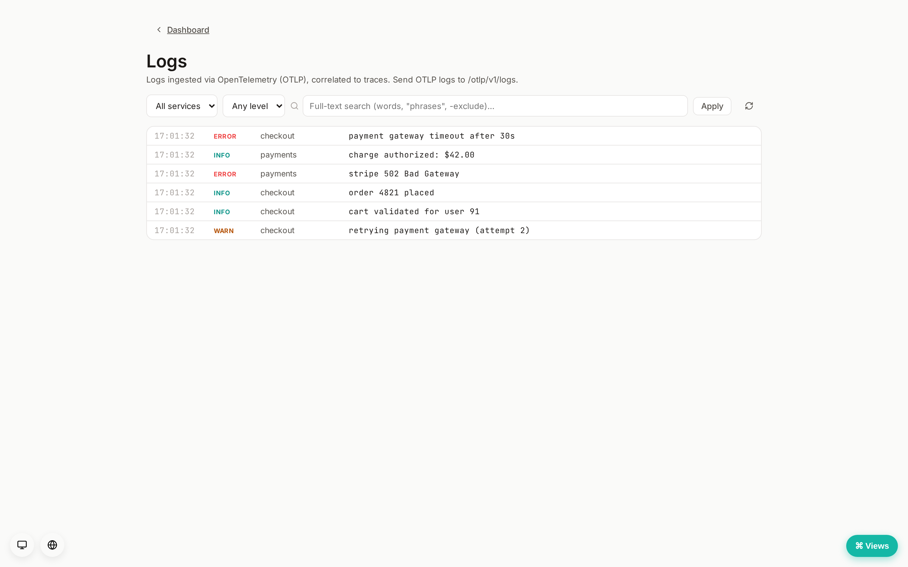

# Log ingestion (Tier 3)

Status: **implemented (v1)**. See [`docs/ROADMAP.md`](../ROADMAP.md) Tier 3.
Builds on the OTLP ingest foundation from the traces tier.

Rampart ingests OpenTelemetry **logs** over OTLP, stores them with their
optional `trace_id`/`span_id`, and serves a filtered log stream — the logs
layer of the observability platform (Datadog Logs / Loki / GlitchTip class),
self-hosted.

## Ingest

`POST /otlp/v1/logs` accepts an OTLP `ExportLogsServiceRequest` in **both**
encodings (chosen by `Content-Type`): OTLP/JSON (`application/json`, parsed by a
tolerant hand-rolled parser in `rampart_core::log` reusing the trace tier's
shared OTLP attribute helpers) and OTLP/protobuf (`application/x-protobuf`, via
`opentelemetry-proto`, lowered to the same `ParsedLog`). Mounted at the root
`/otlp` surface, outside the session layer (single-tenant self-host; operator
controls exposure). Point an OTel SDK/Collector logs exporter at
`http://<host>/otlp`.

`Content-Encoding: gzip`/`deflate` bodies are transparently inflated, and the
optional shared **ingest token** (Settings → Ingest token) gates this endpoint
the same way as the traces tier (`Authorization: Bearer`/`X-Rampart-Token`).
Unsampled — all records are stored, bounded by retention.

## Storage & model

One row per record (`logs` table, migration 0079): event time, OTLP severity
number (1–24) + text, service, body, optional `trace_id`/`span_id` (the
correlation key back to a trace), and flattened attributes (JSONB). A coarse
level (trace/debug/info/warn/error/fatal) is derived from the severity number
on read. Logs age out via a `logs_days` retention window (default 7) folded
into the prune sweep — the highest-volume tier, so retention is short.

## Read API (`/v1/logs`, editor/readonly)

- `GET /v1/logs?service=&level=&q=&trace_id=&limit=` — recent logs, newest
  first. `level` is a *minimum* coarse level (e.g. `warn` → warn+error+fatal,
  translated to a severity-number threshold); `q` is a full-text query over
  the body (a generated `tsvector` column + GIN index, queried with
  `websearch_to_tsquery` — bare words, `"quoted phrases"`, `or`, `-exclude`);
  `trace_id` pulls a single trace's logs.
- `GET /v1/logs/services` — distinct recent service names for the filter UI.
- `GET /v1/logs/levels?service=&hours=24` — record count per coarse level over
  the window (the severity-volume breakdown shown as clickable chips).
- `GET /v1/logs/export.csv?service=&level=&q=&trace_id=&limit=` — the same
  filtered query as a `text/csv` download (file attachment), `limit` clamped to
  50k rows. For continuous forwarding use the syslog/SIEM export sink instead.

## Dashboard

A `#/logs` view: a filter bar (service dropdown, minimum-level dropdown, body
search) + a **live-tail** toggle (polls every 3s — DB-backed, so it works
across replicas) and a **severity-volume bar** (per-level counts, click to
filter). The compact log stream shows timestamp, level (colour-coded),
service, body — with a click-to-expand row revealing `trace_id`/`span_id` (the
trace id links straight to the **waterfall**), the exporter severity text, and
attributes.

## Follow-ups (deferred)

- Ranked full-text results + highlighting (today it's a boolean match filter,
  ordered by time — the `tsvector` + GIN index is in place, migration 0082).
- SSE push tail (today's tail polls); volume sparkline over time.
- A plain-JSON bulk ingest for non-OTel sources; volume controls (sampling /
  drop rules) and an opt-in columnar/object store if Postgres is outgrown.
