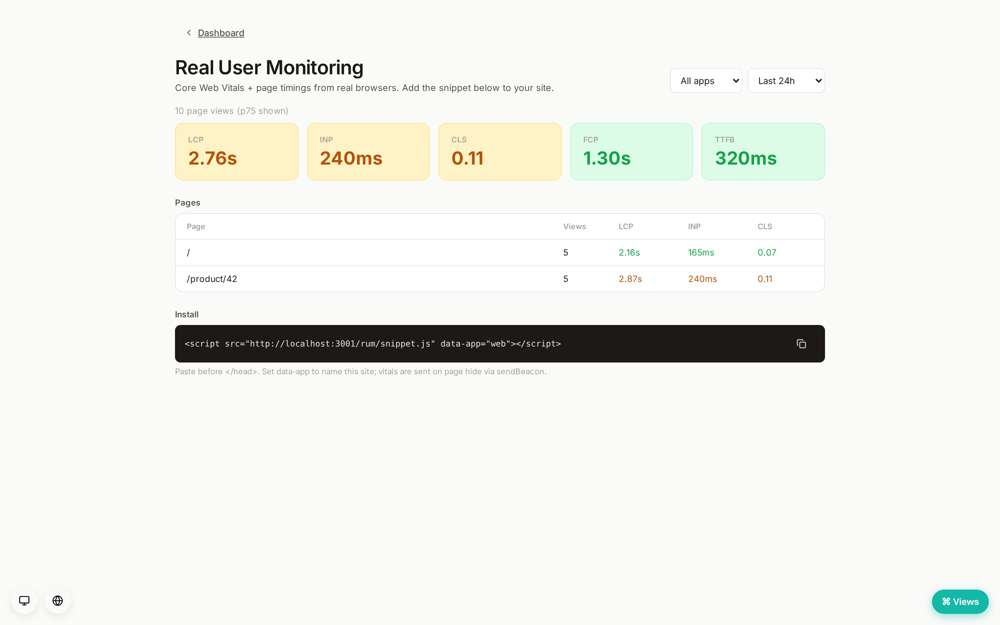

# Real User Monitoring (Tier 4)




Status: **implemented (v1)**. See [`docs/ROADMAP.md`](../ROADMAP.md) Tier 4 —
the last tier, completing the observability platform.

RUM measures the experience of **real browsers**: Core Web Vitals (LCP, INP,
CLS) plus FCP, TTFB, and load time, per page. Competes with Datadog RUM /
Sentry web-vitals, self-hosted.

## The snippet

Rampart serves a tiny self-installing collector at **`GET /rum/snippet.js`**.
One tag installs it:

```html
<script src="https://<rampart-host>/rum/snippet.js" data-app="web"></script>
```

It reads `data-app` (names the site; default `web`), optional `data-endpoint`,
and optional `data-token` (forwarded as `?k=` when an ingest token is
configured — see below), collects vitals via `PerformanceObserver` (LCP, CLS, INP) +
Navigation Timing (TTFB, FCP, load), and sends **one beacon on page hide** via
`navigator.sendBeacon` — no dependency, no build step, ~1 KB. Because
`sendBeacon` uses a simple `text/plain` request, there's no CORS preflight.

### Correlation & identity hooks

Two optional globals let a page tie its loads to the rest of the platform —
both best-effort, both safe to omit:

- **`window.__rampartUser`** — the logged-in user (a string, or an object with
  an `id`). Captured as the beacon's `user_id`, so the RUM **Users** table and
  the per-page drill-down can answer *who* experienced a load.
- **`window.__rampartTraceId`** — the active backend trace id. If absent, the
  snippet falls back to the trace-id field of a `<meta name="traceparent">`
  (W3C `00-<traceid>-<spanid>-<flags>`). Captured as `trace_id`, powering the
  **RUM → trace** deep-link. See [Cross-tier correlation](../CORRELATION.md).

```html
<script>window.__rampartUser = "{{ current_user.email }}";</script>
```

## Ingest

`POST /rum/v1/events` — one beacon:
`{ app, url, session?, ua?, trace_id?, user_id?, metrics }`, where `metrics` is
any subset of `{ lcp, fcp, cls, inp, ttfb, load }`. Public
(beacons come from arbitrary browsers); the body is parsed as JSON regardless
of content-type. A beacon with no URL or no metric is silently dropped (204) —
browsers ignore the response, so ingest never errors. `gzip`/`deflate` bodies
are inflated for the rare client that compresses. Stored one row per view
(`rum_events`, migration 0080) with a `rum_days` retention window (default 14)
in the prune sweep.

If the operator sets the optional shared **ingest token** (Settings → Ingest
token), the beacon must carry it — the snippet appends it as `?k=<token>` from
its `data-token` attribute (`sendBeacon` can't set request headers). A browser
token is necessarily public, so this is an anti-abuse gate, not a secret; the
same token on the OTLP endpoints, sent server-side, *is* a real credential.

### Browser error capture (cross-tier)

The snippet also hooks `window`'s `error` and `unhandledrejection` events and
forwards each uncaught exception to **`POST /rum/v1/errors`**
(`{ app, kind, message, url, stack }`, same token gate). The server funnels it
into the **error-tracking tier**: it finds-or-creates an error project named
after the beacon's `app` (platform `javascript`) and records the exception
through the same group-by-fingerprint path as a backend SDK event — so
front-end errors show up in the Errors view and fire the project's new/regressed
alerts exactly like server errors. The raw JS stack is kept in the event
context (frames aren't parsed/symbolicated yet — see follow-ups).

## Read API (`/v1/rum`, editor/readonly)

- `GET /v1/rum/summary?app=&hours=` — **p75** of each metric over the window
  (p75 is the standard Web Vitals statistic), plus the view count.
- `GET /v1/rum/pages?app=&hours=` — per-URL rollup (views + p75 LCP/INP/CLS),
  busiest first.
- `GET /v1/rum/page?app=&url=&hours=` — the per-URL **drill-down**: recent
  individual loads (when, user/session, browser, LCP/INP, trace link).
- `GET /v1/rum/users?app=&hours=` — views + p75 LCP per `user_id`, busiest first.
- `GET /v1/rum/browsers?app=&hours=` — views + p75 LCP per coarse browser family.
- `GET /v1/rum/traced?app=&hours=` — recent loads that carried a `trace_id`.
- `GET /v1/rum/apps` — distinct app/site names for the filter.

p75 is computed in Postgres with `percentile_cont(0.75) WITHIN GROUP`.

## Dashboard

A `#/rum` view: Core Web Vitals cards (p75 LCP/INP/CLS + FCP/TTFB), each
coloured **good / needs-improvement / poor** against the official thresholds
(`rampart_core::rum::cwv_good_threshold` is the shared source of truth), a
per-page table with the same vitals, an app + time-window filter, and the
copyable install snippet.

## Follow-ups (deferred)

- Per-app keys/CRUD (v1 keys by an `app` name in the beacon, no table).
- Source-map symbolication of the captured JS stacks (today the raw stack is
  stored in the event context; frames aren't parsed).
- Session/user dimensions; geo/device breakdowns; histograms beyond p75.
- INP is approximated (max event duration) — the full INP algorithm is a
  follow-up.
