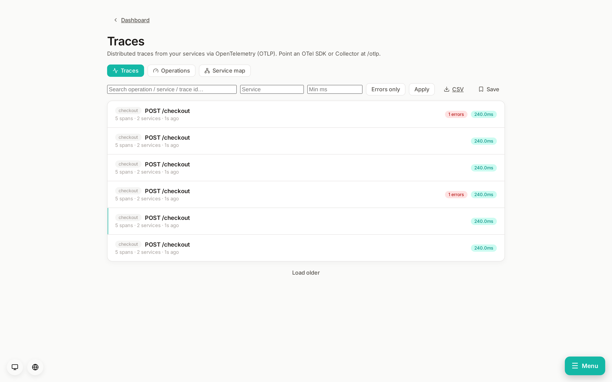
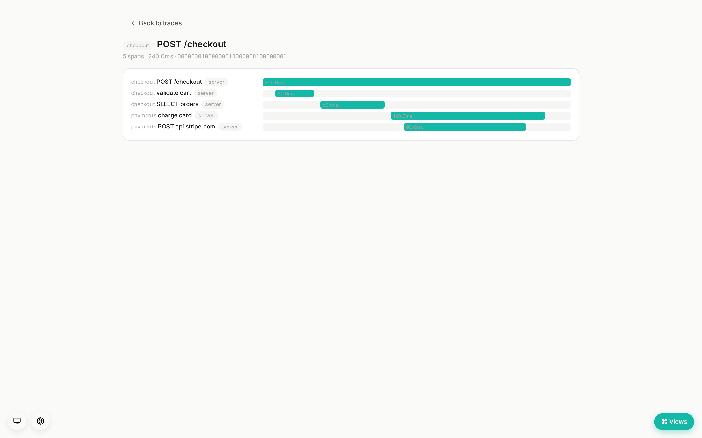
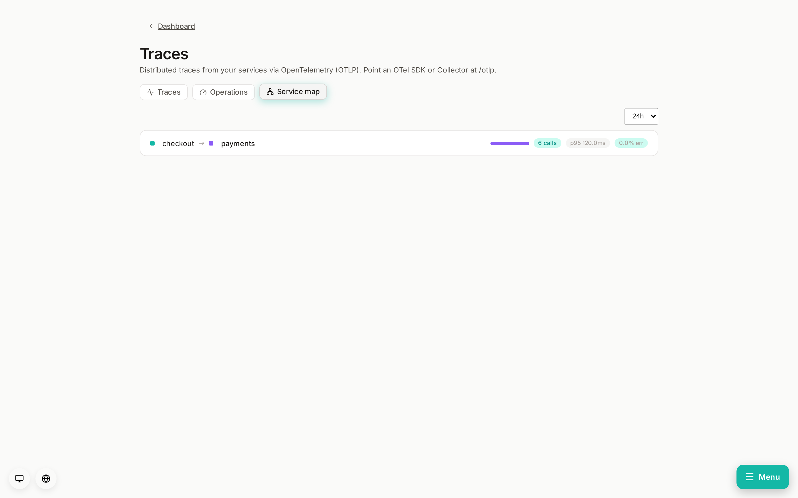

# Distributed tracing (Tier 2 — APM)

The per-trace **waterfall** and the **service map**:

Status: **implemented (v1)**. See [`docs/ROADMAP.md`](../ROADMAP.md) Tier 2.

Rampart ingests OpenTelemetry spans over OTLP and assembles them into traces —
the APM layer that competes with ScoutAPM / Datadog APM / Sentry Performance,
self-hosted and one-binary.

## Ingest

`POST /otlp/v1/traces` accepts an OTLP `ExportTraceServiceRequest` in **both**
encodings, chosen by `Content-Type`:
- `application/json` — OTLP/HTTP JSON (parsed by a hand-rolled tolerant parser
  in `rampart_core::trace`, unit-tested; no dep).
- `application/x-protobuf` — OTLP/protobuf, decoded via the
  `opentelemetry-proto` generated messages, then lowered to the same
  `ParsedSpan`. (rampart-api pins `prost = 0.13` to match that crate's
  generated `Message` trait, distinct from the workspace's prost 0.14.)

Mounted at the root `/otlp` surface, **outside the session layer** — in a
single-tenant self-host deployment the operator controls network exposure,
like a Prometheus scrape target. Point any OTel SDK or Collector's OTLP/HTTP
exporter at `http://<rampart-host>/otlp` (the exporter appends `/v1/traces`).
The response is an empty `ExportTraceServiceResponse` (`{}` = full success).

Requests with `Content-Encoding: gzip` or `deflate` are transparently
inflated (OTel exporters gzip by default). Ingest auth is **optional**: when
the operator sets a shared **ingest token** (Settings → Ingest token) it must
be presented as `Authorization: Bearer <token>` or `X-Rampart-Token`; left
blank, the surface stays open (network-scoped, single-tenant).

**Head sampling** (Settings → Ingest, default off/100%): a deterministic
keep-percentage hashed on `trace_id`, applied before insert — a kept trace
survives whole and a dropped trace leaves no orphan spans, consistently across
batches and replicas. Lower it to cap span volume at the door; retention still
bounds whatever is kept.

## Storage & model

One row per span (`spans` table, migration 0078): ids (hex), service, name,
kind, start/end (unix nanos), duration, status, and flattened attributes
(JSONB). A **trace** is the set of spans sharing a `trace_id`, assembled on
read — there is no separate traces table. A span with no `parent_span_id` is a
root. Spans age out via a `traces_days` retention window (default 7) folded
into the existing prune sweep; this is the highest-volume tier, so retention is
short by default.

## Read API (`/v1/traces`, editor/readonly)

- `GET /v1/traces` — recent traces, one row per `trace_id`: root service +
  operation, total duration, span count, error count, services touched.
  (Aggregate query with a lateral join to the root span.)
- `GET /v1/traces/{trace_id}` — all spans of a trace, ordered by start, for the
  waterfall.
- `GET /v1/traces/export.csv?service=&min_duration_ms=&errors_only=&q=&limit=` —
  the same filtered trace list as a `text/csv` download (file attachment), one
  row per trace, `limit` clamped to 50k rows.
- `GET /v1/traces/service-map?hours=24` — service dependency edges
  (caller → callee, with call counts) derived from cross-service parent/child
  span pairs in the window.
- `GET /v1/traces/operations?service=&hours=24` — the **APM rollup**: spans
  grouped by `(service, operation)` with call volume, error count + rate, and
  p50/p95/p99/avg/max latency (`percentile_cont` over `duration_ms`). The
  "services & resources" numbers; `service` empty = all.

## Dashboard

A `#/traces` view with three tabs: a recent-traces list (service, operation,
duration, span + error counts), an **Operations** tab (the per-(service,
operation) APM table — calls, error %, p50/p95/p99), a **waterfall** trace
detail (each span a bar positioned by offset + duration, errors in red, span
kind tagged), and a **service map** tab (dependency edges as caller → callee
with call counts). The trace-list filter set can be **saved** as a named search
(per-user, in the prefs blob) and recalled as a chip.

## Follow-ups (deferred)

- Tail/head sampling for high volume; an opt-in columnar span store if Postgres
  is outgrown (consistent with the metrics/logs storage stance).
- Per-operation latency trend over time (sparklines); Apdex; slow-trace
  drill-down from an operation row.
- N+1 / slow-query detection from span names.
