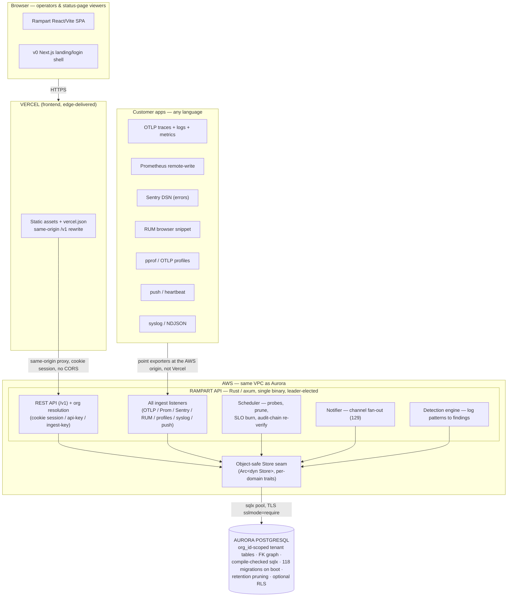

# Rampart — Devpost Submission

> **Paste-ready Devpost write-up** for the H0 Hackathon.
> Deadline: **2026-06-29 17:00 PDT** · Track: **Monetizable B2B App** ·
> AWS Database: **Aurora PostgreSQL** · Frontend on **Vercel** (Vite/React SPA,
> same-origin `/v1` rewrite) with a **v0**-scaffolded Next.js landing shell.
>
> Every claim below maps to shipped code at workspace version **0.157.7**.
> The deploy mechanics live in [`../DEPLOY.md`](../DEPLOY.md) and
> [`../deploy/aws-vercel.md`](../deploy/aws-vercel.md); the demo shot list lives in
> [`DEMO_SCRIPT.md`](DEMO_SCRIPT.md), the zero-to-live runbook in
> [`GO_LIVE.md`](GO_LIVE.md), and the field-by-field readiness state in
> [`CHECKLIST.md`](CHECKLIST.md).
>
> **Honesty guardrails (do not overclaim):**
> - **Multi-backend:** the `DATABASE_URL` scheme picks the store behind one
>   object-safe `Store` trait. **Postgres** is the reference/default build (zero
>   extra deps; what the demo runs on Aurora). **SQLite** (`--features sqlite`) is
>   a *complete monitoring backend* — scheduler / notifier / SIEM dispatch all
>   wired. **MySQL** (`--features mysql`) boots the **management API + telemetry
>   reads**; the scheduler/alerting tail for a few domains isn't ported yet, so we
>   call it a management-API tier. We do **not** claim "runs on five databases" or
>   "MySQL drives monitoring."
> - **Tenancy:** isolation is per-request `org_id` scoping in the app; Postgres
>   row-level security (`RAMPART_RLS`) is opt-in defense-in-depth (ENABLE not
>   FORCE, owner-exempt), turned on in the demo stack. We do **not** claim "RLS
>   enforced everywhere."

---

## Tagline

> Self-hosted observability **and** SIEM in one Rust binary — uptime, traces,
> logs, metrics, RUM, profiling, error tracking, on-call, status pages, and
> security detections — multi-tenant, on Aurora PostgreSQL, no SaaS bill.

## Elevator pitch

> Engineering and security teams stitch together five-plus SaaS products —
> Datadog for metrics, Sentry for errors, PagerDuty for on-call, a status-page
> vendor, a SIEM — five bills, five data silos, five logins, and their most
> sensitive telemetry living on someone else's servers. Rampart collapses all of
> it into one self-hostable, **multi-tenant** Rust binary on a single relational
> database. Point your existing OpenTelemetry, Prometheus, and Sentry exporters at
> it with a URL change and get every tier — tenant-isolated, on infrastructure you
> control, on Aurora PostgreSQL.

---

## Inspiration

Every engineering and security team we know pays for a *stack* of overlapping
SaaS: Datadog for metrics, Sentry for errors, PagerDuty for on-call, a status-page
vendor, a separate SIEM for security detections, and an uptime checker on top.
That's five-plus bills, five-plus data silos, five-plus logins — and your
telemetry, often your most sensitive data, lives on someone else's servers.

We wanted one platform that does all of it, that you can run on infrastructure you
control, and that is **genuinely multi-tenant** — so a platform team can isolate
their internal orgs, and an agency or MSP can run observability for many client
orgs from a single install without their data ever crossing. Observability is
write-heavy, query-heavy, and retention-bound; that is exactly the workload a
relational engine like Aurora PostgreSQL is built to scale, while keeping the
foreign-key integrity our tenant routing and isolation depend on.

## What it does

Rampart is a self-hosted **monitoring, observability, and SIEM** platform that
ships as a single Rust (Axum) binary backed by one relational database. From one
UI and one datastore it delivers what teams normally buy as five-plus separate
SaaS products.

- **Uptime & synthetic monitoring** — **42 monitor kinds** out of the box:
  HTTP / keyword / JSON-query checks, TCP, ICMP ping, DNS (and DNS-over-HTTPS),
  TLS-cert expiry, domain/WHOIS + RDAP, NTP, gRPC health, SSH / SMTP / IMAP /
  POP3 / FTP banner checks, deep service probes for Postgres, MySQL, MSSQL, Redis,
  MongoDB, Memcached, Cassandra/ScyllaDB, Kafka, NATS, AMQP, MQTT, LDAP, SNMP,
  RADIUS, Docker, and headless-browser keyword + multi-step synthetics. Each probe
  carries per-monitor intervals, timeouts, retries, re-alerts, and an optional
  latency SLA. Public status pages, maintenance windows, dependency-aware
  silencing, and tag-based routing are built in.
- **Distributed tracing / APM** — OpenTelemetry OTLP/HTTP (JSON + protobuf, gzip)
  span ingest, a call-tree **waterfall** with self-time, a service **dependency
  map** (p95 + error edges), and per-operation APM rollups with a p95 trend.
- **Structured logs** — OTLP log ingest plus **syslog (RFC 5424 / RFC 3164)** and
  NDJSON, full-text body search (`tsvector`), live tail, and an ELK-style volume
  histogram — correlated to traces by `trace_id`.
- **Metrics** — Prometheus text + remote-write (snappy protobuf) ingest, range
  queries, and threshold alert rules over any series.
- **Real-user monitoring (RUM)** — a drop-in browser `<script>` capturing Core Web
  Vitals (p75 LCP / INP / CLS), per-page drill-down, user/browser breakdowns, and
  JS error capture — linked back to traces.
- **Continuous profiling** — pprof / OTLP-profiles / folded-text ingest rendered
  as an interactive **flamegraph**, with a trace-span → profiling-window pivot.
- **Error tracking** — Sentry-SDK-compatible DSN ingest (point your existing DSN
  at Rampart; no Rampart SDK), group-by-fingerprint into issues, affected-users +
  volume histograms, and error↔trace links.
- **Security / SIEM** — a **detection engine** that raises *findings* from log
  patterns (case-insensitive body regex + attribute match, with
  threshold / window / cooldown semantics and per-entity grouping), a
  **tamper-evident audit log** (HMAC hash chain recording config changes *and*
  auth events — login, failed login, 2FA failure) with in-UI integrity
  verification, **continuous audit-chain re-verification** (the scheduler re-walks
  the chain on a slow-tick and raises a high-severity event if a row was
  edited / deleted / reordered), and **SIEM export** (audit + findings forwarded
  as JSON / CEF / LEEF over webhook, syslog UDP, or syslog TCP).
- **Alerting & response** — tier alert rules (error-rate, trace p95 latency, log
  volume), metric rules, SLOs with rolling error budgets + fast-burn paging,
  escalation ladders with acknowledge/episode lifecycle, on-call rotations, public
  status pages with incidents + email subscribers, and fan-out to **129
  notification channel kinds**.
- **Compliance evidence** — **GDPR** data export + right-to-erasure
  (anonymize-in-place so the audit chain and FK graph stay intact) and a **SOC 2
  CC6 access-review report** (every `(org, member)` grant — role, member-since,
  last login, MFA status — as JSON or an auditor CSV download). Pulling either is
  itself audited.

Everything is **org-scoped**: per-org RBAC, per-org ingest credentials, an org
switcher, OIDC→org claim mapping, and — as defense-in-depth — flag-gated Postgres
row-level security, so tenants never see each other's data.

**One codebase, choose your database.** Every persistence call goes through one
object-safe `Store` trait, so the `DATABASE_URL` scheme picks the backend at boot
— no second codebase. **Postgres** is the reference build (default, zero extra
deps, what the demo runs on Aurora). **SQLite** is a complete monitoring backend
for single-binary / homelab deploys: build `--features sqlite`, point at a
`sqlite:` file, and uptime + telemetry + alerting + SIEM detections all run with
no Postgres to operate. **MySQL** (`--features mysql`) boots the management API
and telemetry reads today; the scheduler/alerting tail is being ported, so we call
it a management-API tier. Same product, same UI — your database, your call.

## How we built it

A **Rust (axum) single-binary backend** is the whole server: the REST API, *every*
ingest listener (OTLP traces/logs/metrics, Prometheus remote-write, Sentry DSN,
RUM beacons, profiles, push/heartbeats, syslog/NDJSON), the scheduler that runs the
probes and the slow-tick maintenance loops, and the notifier that fans alerts out
to the channel adapters — all coordinated by **Postgres advisory-lock leader
election** so you can run multiple replicas (one owns the scheduler, the rest serve
the API) with automatic failover and no duplicate probes or alerts.

The backend is a Cargo workspace of focused crates:

- **rampart-core** — domain types shared everywhere (the `MonitorKind` and
  `ChannelKind` enums, telemetry models). No I/O. The enums are the single source
  of truth for "42 probes / 129 channels."
- **rampart-db** — all persistence behind one **object-safe `Store` seam** so
  `AppState` holds `Arc<dyn Store>` over any backend. Three implementations live
  behind it: `PgStore` (Postgres, default), `SqliteStore` (complete monitoring
  backend, `--features sqlite`), and `MysqlStore` (management-API tier,
  `--features mysql`); the `DATABASE_URL` scheme selects the store at boot. Also
  houses leader election, the tamper-evident audit hash chain, encrypted secrets,
  and multi-tenant scoping.
- **rampart-api** — the Axum HTTP server: REST API, the embedded React SPA, every
  ingest endpoint, OIDC SSO, and multi-tenant org routing.
- **rampart-checker** — the probe engine; one module per protocol family.
- **rampart-scheduler** — leader-aware scheduling so only one node in an HA
  cluster drives probes and background ticks.
- **rampart-notifier** — fans alerts across the notification channels; also
  carries SIEM export (JSON / CEF / LEEF).
- **rampart-ssrf** — a dedicated SSRF-guard crate so user-defined probe targets
  can't be used as a pivot into internal networks.
- **rampart-agent** — an optional thin remote-probe agent binary.

Data lives in **Aurora PostgreSQL** via `sqlx` with **compile-time-checked
queries** (against an offline `.sqlx` cache) and **118 forward-only migrations**
that run on boot. The schema is deliberately relational: an org-scoped foreign-key
graph, composite per-org uniqueness, and time-series retention pruning. Aurora
PostgreSQL is wire-compatible with stock Postgres, so running on it was a
**connection-string change** (`?sslmode=require`), not a rewrite — `sqlx` reads the
TLS settings straight from the URL.

The **operator console** is a React 19 + Vite + Recharts SPA (today baked into the
binary via `rust-embed`); for the hosted submission it deploys to **Vercel** as a
static project with a `vercel.json` same-origin rewrite that proxies `/v1` to the
AWS-hosted API (so the session cookie flows with **zero CORS**), fronted by a
**v0-scaffolded Next.js** landing/login shell. The backend container
(`ghcr.io/pen-pal/rampart`) runs on AWS (App Runner / ECS Fargate / EC2) in the
same VPC as Aurora.

## Architecture



> The plain-ASCII version of this diagram (for tools that don't render Mermaid)
> lives in [`../DEPLOY.md`](../DEPLOY.md). Export either to PNG/SVG for the Devpost
> upload.

## Challenges we ran into

- **Tenant isolation across *every* read and write path** without breaking the
  single-org install. We threaded an `OrgId` through the repository layer, added
  unscoped siblings only where a system loop legitimately needs them, issued
  per-org ingest credentials, and added a *reversible* Postgres row-level security
  layer (off by default, owner-bypass, no schema lock-in) as defense-in-depth — so
  a misconfigured app path can't leak across tenants even if the app-level scope is
  wrong. Retrofitting org scoping onto an existing single-tenant schema meant a
  careful migration sequence (add `org_id`, backfill, flip to NOT NULL + per-org
  uniqueness) staged so it stayed reversible until the final flip.
- **Inverting a deeply Postgres-coupled data layer behind an object-safe trait.**
  The data layer was hundreds of `pool: &DbPool` signatures and call sites. A few
  primitives blocked object-safety (a generic VAPID get-or-create closure,
  `IpNetwork` leaking into a public signature, generic-executor upserts). We
  refactored each — e.g. the audit `NewEntry` now carries `std::net::IpAddr` and
  converts to `IpNetwork` once *inside* `insert`, so the tamper-evident hash chain
  stays **byte-identical** to pre-refactor rows — and landed the seam in small,
  zero-behavior-change slices, each verified by the existing integration suites.
- **One ingest surface, many wire protocols.** OTLP (protobuf), Prometheus
  remote-write (snappy-compressed protobuf), Sentry's envelope/store format, RUM
  beacons, and syslog all speak different languages. Normalizing them into one
  telemetry store without a per-vendor translation layer took real care.
- **Keeping the tamper-evident audit chain honest under refactors and at rest.**
  The HMAC hash chain has to survive both the seam refactor (above) and live
  tampering, and stay strictly linear, so concurrent appends are serialized with a
  Postgres advisory lock to avoid forking the chain. We added continuous chain
  re-verification on a leader-only slow-tick that surfaces a broken chain two ways:
  a high-severity self-telemetry log *and* a forward `audit.chain_verify_failed`
  event.
- **HA on just Postgres.** We wanted high availability without adding ZooKeeper or
  etcd, so leader election runs through Postgres advisory locks; the scheduler and
  background ticks had to become leader-aware.
- **Security hardening for a tool that takes user-defined targets.** SSRF guard on
  every outbound probe and webhook (blocks cloud-metadata / internal ranges),
  AES-256-GCM encryption-at-rest for channel + SMTP secrets (fail-closed when a key
  is set), and trusted-proxy-aware client-IP resolution so per-client rate limits
  and audit IPs can't be spoofed via `X-Forwarded-For`.
- **Vercel frontend ↔ AWS API origin with no product code change.** The SPA assumes
  a same-origin API (relative `/v1` paths, `credentials: 'same-origin'`) and the
  API intentionally does *not* send `Access-Control-Allow-Credentials`, so a
  cross-origin call can't carry the session cookie. The clean answer was a
  `vercel.json` same-origin `/v1` rewrite — no CORS, no code change. Ingest
  endpoints stay pointed at the AWS origin directly, never proxied through Vercel.

## Accomplishments we're proud of

- **Five products, one binary.** Uptime monitoring, errors / traces / logs /
  metrics / RUM / profiling, on-call, public status pages, *and* a SIEM detection
  engine in a single Rust binary with one database dependency — all tenant-isolated
  on a deliberately deep relational schema, with leader-elected HA. No SaaS, no
  per-seat pricing, no data leaving your infra.
- **Breadth that's real, not marketing.** 42 monitor kinds and 129 notification
  channels — every one is an actual enum variant with code behind it, not a roadmap
  item.
- **Drop-in compatibility.** Existing OpenTelemetry SDKs, Prometheus remote-write
  exporters, and Sentry SDKs point at Rampart with just a URL change — adoption
  costs a config line, not an SDK swap.
- **Full multi-tenancy that actually shipped** (Phases 1–5): orgs, org members,
  per-org RBAC, an org switcher, OIDC→org claim mapping, per-org ingest
  credentials, and flag-gated Postgres RLS — not a flag on a single-user tool.
- **Built for trust.** OIDC SSO, leader-election HA, AES-256-GCM secrets at rest,
  a tamper-evident hash-chained audit log with continuous re-verification,
  SSRF-guarded probes, 2FA/TOTP, and compliance tooling (GDPR erasure that
  preserves the audit chain, SOC 2 CC6 access review) were designed in, not bolted
  on.
- **Hardened like a product, not a demo.** In the run-up to submission we audited
  and fixed the failure modes that actually bite multi-tenant, internet-facing
  services — not feature work, *correctness and isolation* work:
  - **No cross-tenant telemetry leaks.** Closed three tenant-isolation gaps: the
    live heartbeat SSE stream (`/v1/stream/heartbeats`) was emitting every org's
    probe results to any authenticated session — now filtered to the caller's
    org; scheduled uptime reports were rendering the whole fleet's monitors into a
    tenant's email — now org-scoped; each fix shipped with a regression test
    (`drops_foreign_org_heartbeats`, `render_is_org_scoped`).
  - **DoS resistance on the public surface.** Rate-limited the unauthenticated
    status-page `/unlock` endpoint, which runs a ~19 MiB Argon2id hash per call —
    it now carries the same per-IP limiter as `/auth` (`429` + `Retry-After`),
    closing a password-hash-amplification DoS and unthrottled guessing, while the
    cheap public reads viewers poll stay unthrottled.
  - **Multi-backend crash safety.** A single `Authorization: Bearer` request used
    to abort the whole process on the non-Postgres backends (a sync `pool()` call
    that panics off-Postgres, fatal under `panic = "abort"`) — a trivial remote
    DoS on a SQLite/MySQL deploy. The `last_used` bump now goes through the
    object-safe `Store` seam, so bearer auth is a clean `401`, never a crash
    (`bearer_api_key_paths_dont_panic_on_sqlite`).
  - **Input-parser hardening + correctness.** Fixed an unsigned-underflow in the
    RFC 5424 syslog structured-data parser (a crafted line to the public `/syslog`
    ingest could panic a checked build or silently corrupt the split), an
    incident-dedup check-then-act race that 500'd and dropped the rest of an
    alert batch, and uptime math that counted planned maintenance as downtime.
    Each landed with a named regression test.
- **Pick your database.** One object-safe `Store` trait lets the same binary run on
  Postgres (reference), SQLite (a complete single-binary monitoring backend), or
  MySQL (management-API tier) — chosen by the `DATABASE_URL` scheme, no fork, no
  second codebase.
- **A working end-to-end demo with *real* data.** The `examples/everything` stack
  brings up a live system — a real instrumented app's traces/logs/metrics/profiles/
  errors, a real browser's RUM, Prometheus remote-write, Alertmanager-driven
  incidents, genuinely flapping monitors, and two isolated orgs — and a `verify.sh`
  asserts every tier is non-empty. The demo shows real telemetry, not seeded rows.

## What we learned

- **Aurora PostgreSQL wire-compatibility is the quiet superpower.** Because the
  depth was in the *schema* (not in a driver), moving onto a managed, auto-scaling
  cluster cost one connection string. The right place to invest was the relational
  data model, not a database abstraction.
- **Trait seams beat config flags for portability.** Putting all persistence behind
  one object-safe `Store` trait turned "support another database" into implementing
  the seam, not a sed-through-the-codebase exercise — that's how we got SQLite to a
  complete monitoring backend and MySQL to a management-API tier from the same
  codebase, with each engine's quirks (no `RETURNING`, JSON-extract differences,
  `STRICT_TRANS_TABLES`) isolated to its own module.
- **Tenant isolation must be enforced *below* the app, not only in it.** App-level
  `org_id` scoping is necessary but a single missed `WHERE org_id = $1` is a leak;
  reversible RLS turns that into defense-in-depth. The risky schema moves (NOT NULL,
  dropping default fallbacks, per-org uniqueness) have huge blast radius and are
  hard to reverse, so we sequenced them to stay safe until the final flip.
- **A tamper-evident chain only stays trustworthy if you keep proving it.** Manual
  verification is theater if no one runs it — proactive re-verification is what
  makes the integrity claim real.
- **The enum is the spec.** Letting the `MonitorKind` / `ChannelKind` enums be the
  single source of truth — and re-deriving every count and doc from them —
  eliminated a whole class of "the README says 41 but the code has 42" drift.
- **Compatibility is a feature.** Speaking OTLP, Prometheus, Sentry, and syslog on
  the wire means adoption costs a URL change, not an SDK swap — that lowered the bar
  far more than any custom protocol could have.

## What's next for Rampart

- **Finish the MySQL monitoring tier.** MySQL already boots the management API and
  telemetry reads behind the `Store` seam; next is porting the remaining
  scheduler/notifier-dependency domains (maintenance, silences, routing, templates,
  monitor groups, agents) so the alerting tier runs on MySQL too — the same tail
  SQLite has already completed.
- **Aurora read-replica routing** for the query tier — point reads at a reader
  endpoint while writes hit the writer.
- **Promote RLS from defense-in-depth to the enforced default** (the multi-tenancy
  Phase 6 enforcement flip).
- **Per-tenant data-retention tiers** and a **hosted multi-org SaaS** built on the
  same binary.
- **More synthetics and alerting depth** — richer multi-step browser flows and more
  expressive escalation policies — plus continued operational polish so a
  first-time operator is monitoring in minutes.

## Built with

`rust`, `axum`, `tokio`, `sqlx`, `postgresql`, `aurora`, `sqlite`, `mysql`,
`react`, `vite`, `recharts`, `opentelemetry`, `otlp`, `prometheus`, `sentry`,
`syslog`, `grpc`, `protobuf`, `docker`, `kubernetes`, `helm`, `oidc`, `vercel`,
`self-hosted`

Safest core subset if Devpost limits the tag count:

`rust`, `axum`, `tokio`, `postgresql`, `sqlx`, `react`, `vite`, `opentelemetry`,
`prometheus`, `sentry`, `docker`, `oidc`

**Wire protocols ingested:** OpenTelemetry (OTLP/HTTP traces + logs + metrics +
profiles), Prometheus (text / remote-write), Sentry DSN, pprof, RFC 5424 / RFC 3164
syslog, NDJSON, a public push/heartbeat endpoint.
**Security / crypto:** HMAC audit hash chain, AES-256-GCM secrets-at-rest, p256 +
aes-gcm Web Push (RFC 8291), TOTP 2FA, OIDC SSO, SSRF guard.
**SIEM interop:** JSON / CEF / LEEF export over webhook, syslog UDP, syslog TCP.

---

## Which AWS Database did you use? (required Devpost field)

> **Aurora PostgreSQL.** Rampart's entire data model is relational by design —
> org-scoped tenant tables with a foreign-key graph, composite per-org uniqueness
> constraints, transactional alert routing, and time-series retention pruning. We
> run on Aurora PostgreSQL via a standard connection string with `sslmode=require`;
> all 118 migrations apply automatically on boot. Because Aurora PostgreSQL is
> wire-compatible with stock Postgres and we use `sqlx` (which reads TLS settings
> straight from the connection URL), moving to Aurora was a connection-string
> change, not a rewrite — the depth is in the schema, which Aurora's Serverless v2,
> storage auto-scaling, and read-path scaling are built for. We also lean on
> Postgres advisory locks for both leader-election HA and serializing the
> tamper-evident audit hash chain, and on optional row-level security
> (`RAMPART_RLS`) for tenant defense-in-depth. We deliberately did **not** use a
> key-value store (Aurora DSQL / DynamoDB): the FK graph, joins, composite
> uniqueness, and transactional routing are the opposite of a KV fit.

---

## Try it / Demo

### Local quickstart (zero config — works today)

```bash
git clone https://github.com/pen-pal/rampart.git
cd rampart
docker compose up -d
```

Open <http://localhost:3000> — the first visit creates the admin account and
migrations run on boot. To populate every tier with a representative slice of demo
data: `docker compose exec rampart rampart-api seed-demo` (idempotent; everything
it creates is tagged `[demo]`). See [`../DEMO.md`](../DEMO.md).

### The live "everything" stack (real data, every feature)

```bash
cd examples/everything
docker compose up
bash verify.sh        # asserts every tier is non-empty
```

One Rampart container + Postgres, a one-shot provisioner that creates all config
(monitors of all 42 kinds, ~128 channels, escalation/on-call/SLO, status pages +
incidents + ingest tokens, a 2nd org, RLS on), and **real** services that fill
every telemetry tier: an instrumented Node app emits OTLP traces/logs/metrics +
folded CPU profiles + `@sentry/node` errors + browser RUM; Prometheus scrapes +
`remote_write`s; Alertmanager opens/closes incidents through the real ingest
webhook; crons push real metrics + push-monitor heartbeats; a from-source remote
agent probes a private-only target. See `examples/everything/README.md`.

### Hosted (Vercel + AWS + Aurora)

The cloud deploy — React SPA on **Vercel**, the Rampart binary on **AWS**, managed
Postgres on **Aurora/RDS** — is documented step by step in
[`../DEPLOY.md`](../DEPLOY.md) and [`../deploy/aws-vercel.md`](../deploy/aws-vercel.md).
The `frontend/vercel.json` same-origin `/v1` rewrite is already in the repo; only
the real AWS API origin needs filling at deploy time.

### Submission links (fill after deploy — see [`CHECKLIST.md`](CHECKLIST.md))

- **Repo:** <https://github.com/pen-pal/rampart>
- **Live frontend (Vercel Project Link):** _______________
- **Vercel Team ID:** _______________
- **Demo video (YouTube, < 3 min):** _______________
- **Architecture diagram:** the Mermaid/ASCII block above, exported to PNG/SVG
- **AWS-DB-usage screenshot:** Aurora console (engine, Available, Monitoring) +
  redacted `DATABASE_URL`
