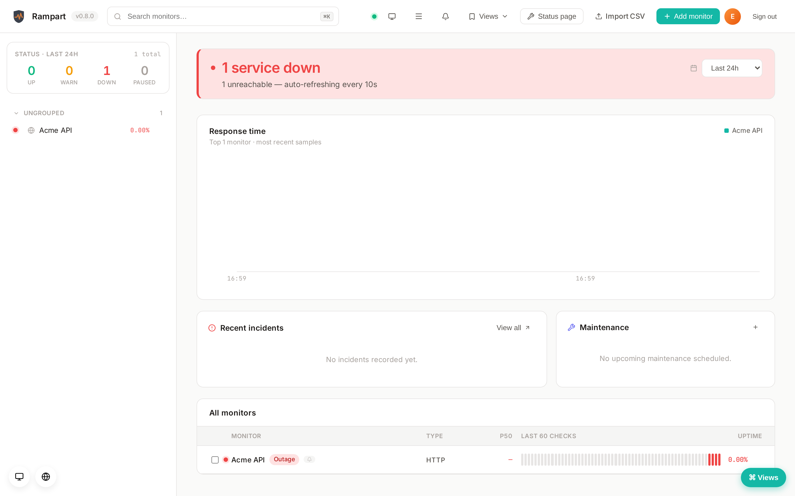
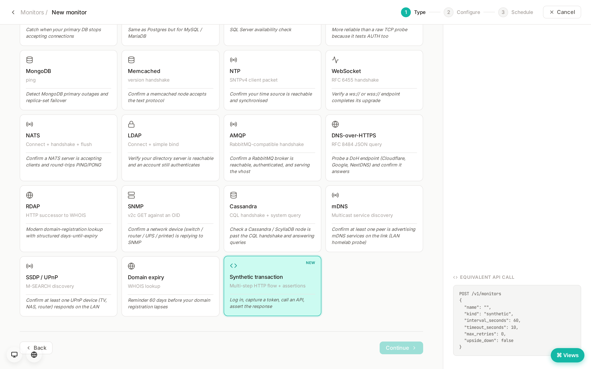

# Rampart

<p align="center">
  
</p>

**Self-hosted uptime monitoring _and_ observability you can actually trust.**
One Rust binary, one Postgres — status pages, error tracking, distributed
traces, logs, and RUM, with no SaaS and zero telemetry.

[Get started](SETUP.md){ .md-button .md-button--primary }
[First-run walkthrough](WALKTHROUGH.md){ .md-button }

---

## What is Rampart?

Rampart started as a self-hosted uptime monitor and grew into a small-team
**observability platform**: the four telemetry tiers a team actually needs,
each wired into the same alert / notify / escalation spine, shipped as a single
~10 MB binary backed by Postgres. It's a self-hostable alternative to stitching
together Datadog / Sentry / Site24x7 / ScoutAPM — without a second platform to
operate or pay for.

It is **single-tenant by design**, source-available under **AGPL-3.0**, and
**phones home to nobody**.

## The tiers

| Tier | What it does | Wire format |
| :--- | :--- | :--- |
| [Uptime monitoring](SETUP.md) | 38 probe kinds (HTTP, DBs, banner protocols, messaging, …), status pages, dependency-aware alerting. | native |
| [Error tracking](design/ERROR-TRACKING.md) | DSN-keyed ingest, group-by-fingerprint issues, new/regressed alerts. | **Sentry** SDKs |
| [Traces / APM](design/TRACES.md) | Span ingest, per-trace waterfall, service dependency map. | **OpenTelemetry** OTLP |
| [Logs](design/LOGS.md) | Severity/service filtering, full-text search, trace correlation. | **OpenTelemetry** OTLP |
| [RUM](design/RUM.md) | Core Web Vitals (p75) + browser JS-error capture into the error tier. | drop-in `<script>` |

Point your existing SDKs and collectors at Rampart — there is no proprietary
Rampart agent to adopt.

## Alerting & response

- **[Telemetry alert rules](design/ALERT-RULES.md)** — thresholds over the
  error / trace / log tiers (error-rate, p95 latency, error-rate %, log volume).
- **[Metric rules](METRICS.md)** — Prometheus-text ingest + threshold alerts.
- **[Escalation policies](ESCALATIONS.md)** — ordered notification ladders with
  acknowledge + episode lifecycle.
- **[On-call rotations](ON-CALL.md)** — rotating channel schedules feeding ladders.
- **128 notification channels** — chat, SMS, push, incident/on-call, issue
  trackers, webhooks. See [Notifications](NOTIFICATIONS.md).

## A look around

<div class="grid cards" markdown>

-   __Dashboard__

    

-   __Error tracking__

    

-   __Traces (waterfall)__

    

-   __Service map__

    

-   __Logs__

    

-   __RUM — Web Vitals__

    

-   __Tier alert rules__

    

-   __Synthetics builder__

    

</div>

## Run it

```bash
git clone https://github.com/pen-pal/rampart.git
cd rampart
docker compose up -d
# open http://localhost:3000 — first visit creates the admin account
```

See [Install & setup](SETUP.md) for production (TLS, reverse proxy, backups) and
the [single-binary](SETUP.md) path.

## Design principles

- **One binary.** Frontend embedded via `rust-embed`; no Node runtime on the host.
- **Postgres-backed.** The database you already operate — no SQLite, no proprietary store.
- **Open wire formats.** OpenTelemetry + Sentry in, 128 channels out. No lock-in.
- **Single-tenant.** No `workspace_id` anywhere; the operator controls exposure.
- **Zero telemetry.** Nothing phones home.

See [Architecture](ARCHITECTURE.md) for the rationale, and
[CONTRIBUTING](https://github.com/pen-pal/rampart/blob/main/CONTRIBUTING.md) for
what is and isn't in scope.
